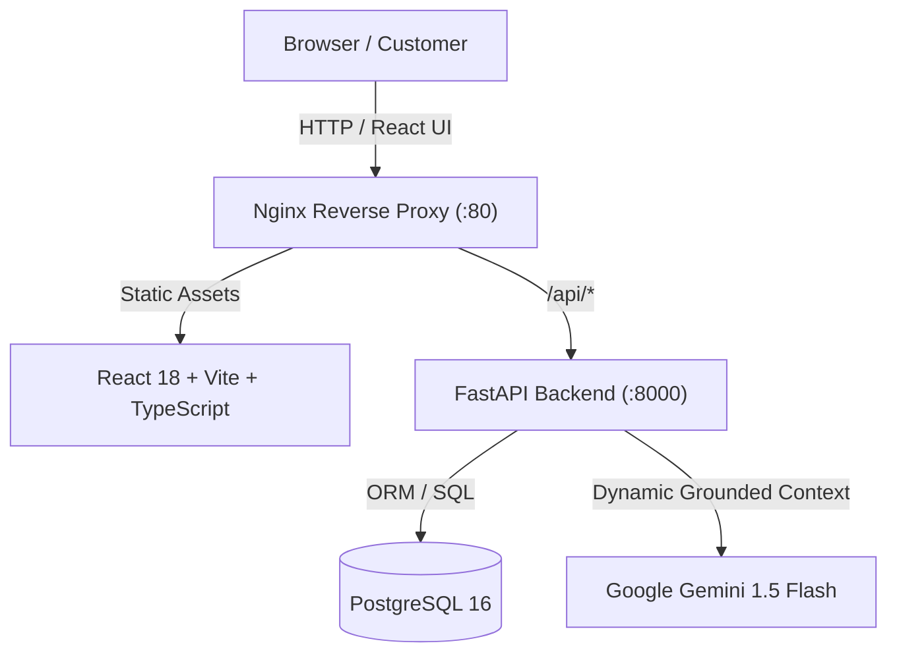

# Wasl AI 
**Multi-Tenant AI Business Assistant Platform**

[](https://www.python.org/downloads/)
[](https://fastapi.tiangolo.com/)
[](https://react.dev/)
[](https://www.typescriptlang.org/)
[](https://www.docker.com/)
[]()

Wasl AI is an enterprise-grade, multi-tenant AI business assistant platform designed to automate customer service, appointment scheduling, and lead generation for small-to-medium businesses (SMBs) and franchises. 

By injecting real-time verified business knowledge—service catalogs, transparent pricing tiers, operating hours, and curated FAQs—directly into Google Gemini LLMs with strict grounding constraints, Wasl AI **guarantees zero hallucinations** while operating 24/7.

---

## 🌟 Core Features

- 🏢 **Strict Multi-Tenancy**: Isolated business profiles, catalogs, FAQs, customer leads, and booking schedules linked via indexed foreign keys and database cascading rules.
- 🛡️ **Grounded Zero-Hallucination AI**: Dynamic context builder injects live catalog prices and operating hours into LLM system prompts; explicitly forbids guessing unverified information.
- 💬 **Multi-Turn Stateful Chat Widget**: Modern floating React widget with session persistence, typing states, and quick-reply chips.
- 📅 **Integrated Booking & Lead CRM**: Real-time appointment scheduling with service linkage and contact capture with pipeline status tracking (`new`, `contacted`, `converted`, `closed`).
- 📊 **Business Owner Dashboard**: Full administrative portal for managing services, updating prices, adding FAQs, confirming bookings, and triaging leads.
- 🔐 **Stateless JWT Security**: Industry-standard cryptographic auth using native `bcrypt` password hashing and signed JSON Web Tokens.
- 🐳 **One-Command Docker Deployment**: Multi-stage containers with non-root security, Nginx reverse proxy, and PostgreSQL orchestration.

---

## 🏗️ Architecture & Tech Stack



### Backend
- **Framework**: Python 3.11+ / FastAPI
- **ORM & Database**: SQLAlchemy 2.0+ (declarative typed models) & PostgreSQL / SQLite
- **Validation**: Pydantic v2 Settings & Schemas
- **AI Engine**: Google Gemini API (`gemini-1.5-flash` with async non-blocking client)
- **Security**: Native `bcrypt` + `python-jose` (HS256 JWT)

### Frontend
- **Framework**: React 18+ (Vite toolchain)
- **Language**: TypeScript 5.4+ (strict mode, zero errors)
- **Styling**: Tailwind CSS 3.4+ with custom branding
- **Icons**: Lucide React

---

## 📂 Project Structure

```text
wasl-ai/
├── docker-compose.yml                  # Full stack orchestration (DB, API, Web)
├── .env.example                        # Template for environment configuration
├── README.md                           # Documentation & system roadmap
│
├── backend/                            # FastAPI Application
│   ├── Dockerfile                      # Multi-stage Python 3.11-slim container
│   ├── requirements.txt                # Pinned production dependencies
│   ├── pyproject.toml                  # Pytest & packaging configuration
│   ├── app/
│   │   ├── core/                       # App settings (Pydantic), security & hashing
│   │   ├── db/                         # SQLAlchemy session factory & base
│   │   ├── models/                     # Business, Service, FAQ, Lead, Booking, User
│   │   ├── schemas/                    # Request/response validation schemas
│   │   ├── services/ai/                # Gemini client, system instructions, context builder
│   │   └── api/v1/                     # REST routes (businesses, chat, leads, bookings, auth)
│   ├── scripts/                        # Synthetic demo generator & database seeder
│   └── tests/                          # Automated test suite (21 tests)
│
└── frontend/                           # React + TypeScript Vite Application
    ├── Dockerfile                      # Multi-stage Node build + Nginx Alpine
    ├── nginx.conf                      # Nginx reverse proxy & SPA configuration
    ├── package.json                    # NPM dependencies and build scripts
    ├── vite.config.ts                  # Vite config with backend proxy
    └── src/
        ├── components/layout/          # Top Navbar & multi-tenant switcher
        ├── features/
        │   ├── showcase/               # Public customer storefront & service catalog
        │   ├── chat-widget/            # Floating multi-turn AI assistant
        │   └── dashboard/              # Business owner management dashboard
        ├── services/                   # Typed API HTTP client
        └── types/                      # Shared TypeScript models
```

---

## 🗺️ Implementation Roadmap

- [x] **Phase 1: Project Architecture and Folder Structure**
- [x] **Phase 2: Backend FastAPI Setup**
- [x] **Phase 3: Database Configuration and SQLAlchemy Models**
- [x] **Phase 4: Synthetic Data Generator and Database Seeding**
- [x] **Phase 5: CRUD APIs for Businesses, Services, and FAQs**
- [x] **Phase 6: Gemini AI Integration**
- [x] **Phase 7: AI Business Knowledge Context System**
- [x] **Phase 8: Chat API**
- [x] **Phase 9: Booking and Lead APIs**
- [x] **Phase 10: Frontend React Application**
- [x] **Phase 11: Business Dashboard**
- [x] **Phase 12: Authentication (JWT)**
- [x] **Phase 13: Testing**
- [x] **Phase 14: Docker & Deployment Preparation**

---

## 🚀 Quickstart Guide

### Option 1: One-Command Docker Deployment (Recommended)

1. **Clone the repository and prepare environment variables**:
   ```bash
   cp .env.example .env
   ```
   *(Optional: set your `GEMINI_API_KEY` in `.env` to enable live Gemini AI generation)*

2. **Start the complete stack**:
   ```bash
   docker compose up --build -d
   ```

3. **Access the application**:
   - **Frontend & AI Chat**: `http://localhost`
   - **FastAPI OpenAPI Docs**: `http://localhost:8000/docs`
   - **API Health Endpoint**: `http://localhost:8000/health`

---

### Option 2: Local Development Setup

#### 1. Backend Setup (FastAPI)
```bash
cd backend

# Create virtual environment
python -m venv .venv
source .venv/bin/activate       # On Windows: .venv\Scripts\activate

# Install dependencies
pip install -r requirements.txt

# Seed synthetic businesses (Beauty salon, Dental, Hotel, Travel, Repairs)
python -m scripts.seed_data

# Run development server
uvicorn app.main:app --reload --port 8000
```

#### 2. Frontend Setup (React + Vite)
```bash
cd frontend

# Install packages
npm install

# Start Vite development server
npm run dev
# Accessible at http://localhost:5173 (proxies /api to localhost:8000)
```

---

## 🧪 Testing & Verification

Wasl AI includes a complete automated test suite covering unit, functional, and end-to-end integration scenarios.

### Run Backend Tests
```bash
cd backend
pytest tests/ -v
```
**Results**:
```text
======================= 21 passed, 3 warnings in 9.12s =======================
```

### Run Frontend Typecheck & Build
```bash
cd frontend
npm run build
```
**Results**:
```text
✓ 1510 modules transformed.
dist/index.html                   1.01 kB
dist/assets/index.css            27.23 kB
dist/assets/index.js            196.59 kB
✓ built in 11.81s
```

---

## 📡 API Endpoint Reference

| Method | Endpoint | Description |
| :--- | :--- | :--- |
| `GET` | `/health` | Service health status check |
| `GET` | `/api/v1/businesses/` | List all businesses |
| `POST` | `/api/v1/businesses/` | Create a new business tenant |
| `GET` | `/api/v1/businesses/{id}` | Get business by ID or slug |
| `GET` | `/api/v1/businesses/{id}/services/` | List services for business |
| `POST` | `/api/v1/businesses/{id}/services/` | Add service to business catalog |
| `GET` | `/api/v1/businesses/{id}/faqs/` | List FAQs for business |
| `POST` | `/api/v1/businesses/{id}/faqs/` | Add FAQ to business knowledge base |
| `POST` | `/api/v1/businesses/{id}/chat/` | Send message to grounded AI assistant |
| `GET` | `/api/v1/businesses/{id}/chat/history/{session_id}` | Retrieve conversation history |
| `GET` | `/api/v1/businesses/{id}/leads/` | List customer leads (CRM) |
| `POST` | `/api/v1/businesses/{id}/leads/` | Submit customer lead inquiry |
| `GET` | `/api/v1/businesses/{id}/bookings/` | List appointment bookings |
| `POST` | `/api/v1/businesses/{id}/bookings/` | Book service appointment |
| `POST` | `/api/v1/auth/register` | Register business owner account |
| `POST` | `/api/v1/auth/login` | Authenticate and obtain JWT access token |
| `GET` | `/api/v1/auth/me` | Retrieve authenticated user profile |

---

## 📄 License

This project is open-source and available under the [MIT License](LICENSE).
